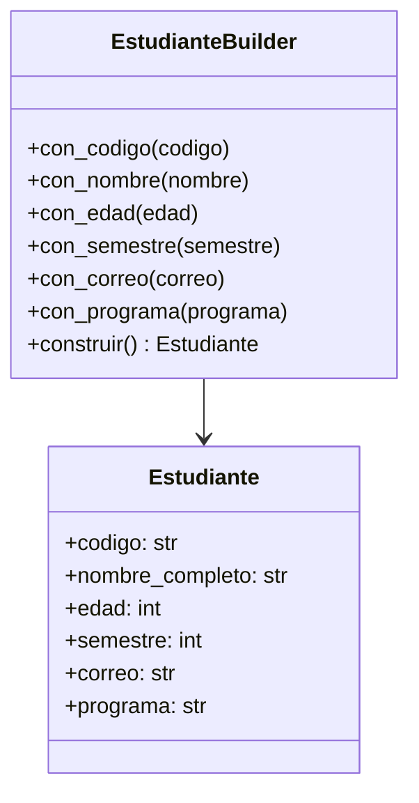
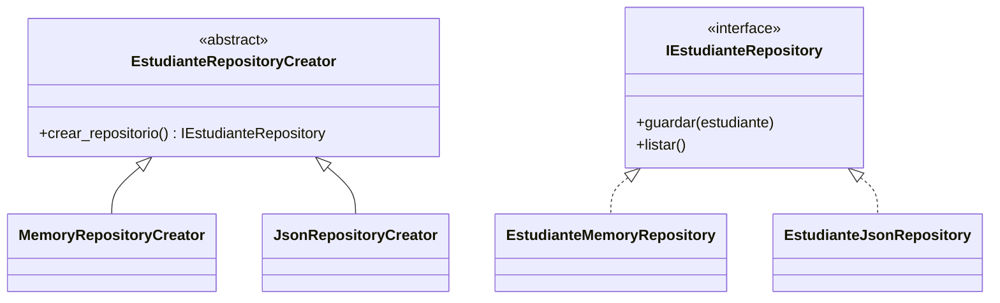

# Actividad 8 - Practica GoF con Estudiante

## Objetivo

Implementar ejemplos aplicados al proyecto de asignatura usando la clase
`Estudiante` y los patrones GoF asignados: **Builder** y **Factory Method**.

## Builder

El patron Builder se aplica mediante `EstudianteBuilder`, encargado de construir un
`Estudiante` paso a paso. Esto evita constructores largos en la interfaz de
usuario o en servicios de negocio.



## Factory Method

Factory Method se aplica con `EstudianteRepositoryCreator`, que define el metodo
`crear_repositorio()`. Sus creadores concretos devuelven un repositorio en
memoria o un repositorio JSON sin que el cliente dependa directamente de la clase
concreta.



## Casos de prueba

Builder:

1. `test_builder_construye_estudiante_valido` valida construccion y normalizacion
   de codigo/correo.
2. `test_builder_rechaza_estudiante_sin_edad` valida rechazo de datos
   obligatorios incompletos.

Factory Method:

1. `test_factory_method_crea_repositorio_en_memoria` valida el creator de
   repositorio en memoria.
2. `test_factory_method_crea_repositorio_json` valida el creator de repositorio
   JSON.

## Comandos

```bash
python3 main.py
python3 -m pytest -v -o cache_dir=/tmp/actividad8_pytest_cache
python3 -m flake8 . --max-line-length=79
```

La evidencia de funcionamiento esta en `docs/evidencia_pruebas.txt`.
